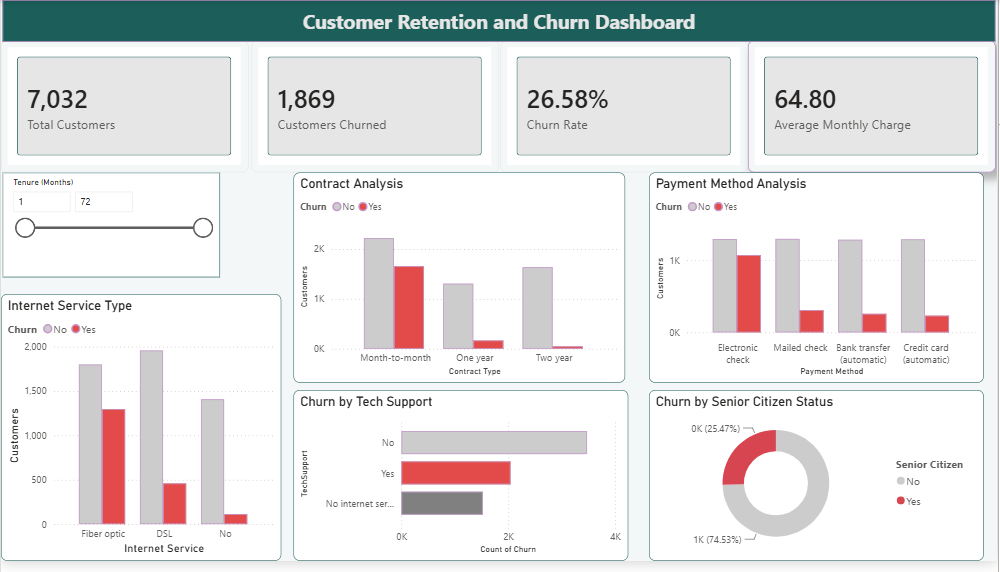

# Telco Customer Churn Analysis

Analysis of 7,032 telecom customers to identify the factors associated with churn, with an interactive Power BI dashboard and a written business report.

## Dashboard

## Key Findings

- **Contract type** is the strongest predictor. Month-to-month customers churned at 42.71%, compared to 11.28% on one-year and 2.85% on two-year contracts.
- **Tenure** shows churn concentrates early. Churned customers had a median tenure of 10 months against 38 months for retained customers.
- **Payment method** matters. Electronic cheque users churned at 45.29%, against 15.25% for credit card.
- **Online security.** Customers without it churned at 41.78%, nearly three times the 14.64% among subscribers.

## Data Cleaning

The `TotalCharges` column was stored as text rather than a numeric type. Investigating this revealed 11 entries containing a blank space rather than a value. Every affected row had a tenure of zero, indicating customers who had signed up but not yet been billed. These records were removed, leaving 7,032 customers.

## Files

- `notebook/` — cleaning and exploratory analysis
- `visualizations/` — charts and Power BI dashboard
- `report/` — written report with recommendations
- `presentation/` — slide deck summarising the findings
- `data/` — raw and cleaned datasets

## Tools

Python (pandas, seaborn, matplotlib), Power BI
